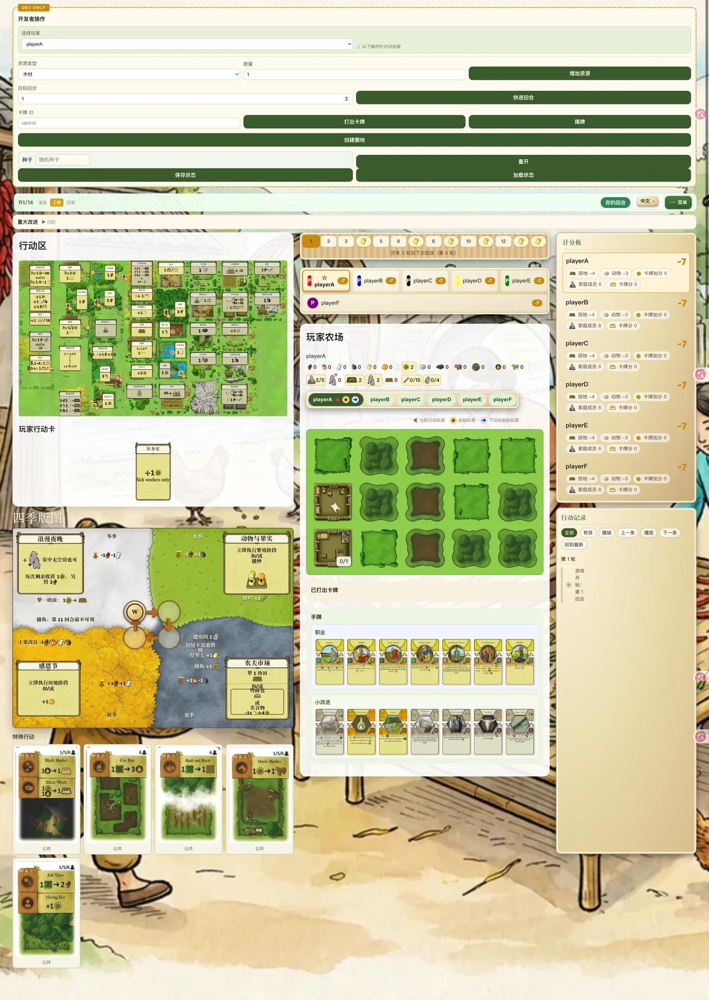

# Open Agricola

[English](README.md) | [中文](README_zh.md)

Open Agricola aims to support every Agricola expansion. Currently supported:
- All 888 cards from Revised Edition decks A–E
- Parent Cards
- Through the Seasons
- Farmers of the Moor

The project also aims to provide solid infrastructure for players to create new expansions through the Card Workshop.

> Fun fact: All code in this repository has been produced by AI agents so far.

[](https://github.com/titanxxh/open-agricola/actions)
[](https://github.com/titanxxh/open-agricola/actions/workflows/deploy-pages.yml)
[](LICENSE)
[](https://titanxxh.github.io/open-agricola/)
[](https://ko-fi.com/titanxxh)
[](https://afdian.com/a/titanxxh)

> **Disclaimer**: Open Agricola is a fan-made implementation. Agricola © Uwe Rosenberg / Lookout Spiele / Z-Man Games. This project is not affiliated with or endorsed by the rights holders.

## Features

- Server-authoritative gameplay with real-time multiplayer synchronization over WebSocket
- Rooms for 2–6 players, simultaneous drafting, the Community Deck, and custom Workshop cards
- **LLM-Assisted Card Design** — Design custom cards with an LLM in the browser and automatically generate Agricola-style artwork and **implementation code**; configure the GitHub integration to submit PRs directly from the Workshop

## Live Demo

https://titanxxh.github.io/open-agricola/



## Quick Start

Prerequisites: Node.js 24 and pnpm. The pnpm version is pinned by the `packageManager` field in `package.json`. `isolated-vm` 7 requires `node >= 24`, and native dependencies such as `better-sqlite3` are compiled against the Node ABI, so an older runtime causes a `NODE_MODULE_VERSION` mismatch.

The `canvas` package is built from source and requires the following system libraries and build tools before running `pnpm install`:

```bash
# Debian / Ubuntu
sudo apt-get install -y build-essential pkg-config python3 \
  libcairo2-dev libpango1.0-dev libjpeg-dev libgif-dev librsvg2-dev libpixman-1-dev

# macOS
brew install pkg-config cairo pango libpng jpeg giflib librsvg pixman
```

```bash
pnpm install
./restart-local.sh    # Start the backend (5175) and frontend (5173) on 127.0.0.1
./restart-local.sh --intranet   # Same, but bind to the LAN IP so other machines can connect
```

Common verification commands:

```bash
pnpm test:fast
pnpm run lint
pnpm run build
```

## URL Parameters

| Parameter | Description |
|---|---|
| `player=p1` / `player=p2` | Lock the view to a specific player |
| `transport=ws` | Enable real-time synchronization over WebSocket |
| `room=<id>` | Join a specific room |
| `maxPlayers=2..6` | Set the player count when creating a WebSocket room |
| `draftMode=simultaneous` | Enable simultaneous drafting when creating a WebSocket room |
| `draftPoolSize=7..10` | Set the pool size for each card type in the draft |
| `enableCommunityDeck=true` | Include the Community Deck when creating a WebSocket room |
| `enableParentCards=true` | Enable Parent Cards when creating a WebSocket room |
| `enableThroughTheSeasons=true` | Enable Through the Seasons when creating a WebSocket room |
| `enableFarmersOfTheMoor=true` | Enable Farmers of the Moor when creating a WebSocket room |
| `allowIncompleteFarmersOfTheMoorMinorDeal=true` | Allow the game to start with an incomplete Farmers of the Moor minor improvement pool |
| `customCards=id1,id2` | Load Workshop card IDs when creating a WebSocket room |
| `devMode=1` | Enable the developer panel in the fixed development room or embedded sandbox |
| `page=workshop` | Open the Workshop page |
| `page=login` | Force the login page; authenticated users are redirected to the lobby |

## Project Structure

```
shared/    Shared domain models, engine, cards, actions, and protocols
server/    Authoritative backend over HTTP and WebSocket
client/    React UI, transport abstractions, and hooks
docs/      Architecture, deployment, platform design, and card progress
```

## Tech Stack


The backend uses Node.js, WebSocket, and SQLite (`better-sqlite3`); the frontend uses React 19, Vite 8, and TypeScript.

## Documentation

| Topic | Doc |
|---|---|
| Architecture | [docs/ARCHITECTURE.md](docs/ARCHITECTURE.md) |
| Deployment | [docs/HOW_TO_DEPLOY.md](docs/HOW_TO_DEPLOY.md) |
| Platform & Workshop | [docs/PLATFORM_DESIGN.md](docs/PLATFORM_DESIGN.md) |
| Card Test Template | [docs/CARD_TEST_TEMPLATE.md](docs/CARD_TEST_TEMPLATE.md) |
| Card Implementation Status | [docs/card_implementation_status.md](docs/card_implementation_status.md) |
| Custom Card Sandbox | [docs/CUSTOM_CARD_SANDBOX.md](docs/CUSTOM_CARD_SANDBOX.md) |
| Community Cards | [docs/community_cards.md](docs/community_cards.md) |
| CI Checks | [docs/operations/ci-checks.md](docs/operations/ci-checks.md) |

## Contributing

PRs are welcome. See [CONTRIBUTING.md](CONTRIBUTING.md) for development setup, testing, commit, and PR conventions. See [AGENTS.md](AGENTS.md) for AI collaboration constraints, including card implementation rules, documentation synchronization requirements, and testing boundaries. Report security vulnerabilities privately according to [SECURITY.md](SECURITY.md).

## Support the Project

Open Agricola is free to play and nothing in it is paywalled. **Sponsorship goes entirely to running the public server** — hosting for the backend VPS and for the off-site backup machine. It is not a donation to the developer; it is what keeps the live game online.

[](https://ko-fi.com/titanxxh)

<a href="https://afdian.com/a/titanxxh"></a>

## License

[Apache 2.0](LICENSE). See [NOTICE](NOTICE) for the fan project disclaimer and artwork attribution.
