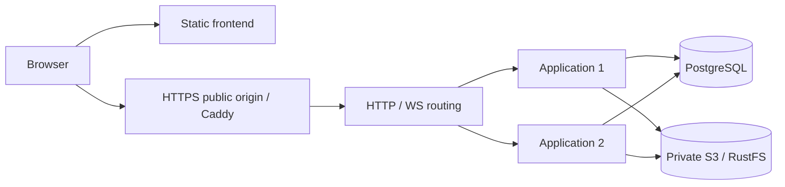

# How to Deploy Open Agricola

[English](HOW_TO_DEPLOY.md) | [中文](HOW_TO_DEPLOY_zh.md)

This guide is for developers who want to self-host the Open Agricola platform.

## Architecture Overview




The frontend and backend are fully separated. The frontend is a static GitHub Pages site; the backend runs in a Docker container on a VPS.

---

## 1. Deploy the Backend

There are two deployment cases:

- **Case A:** a new VPS with only a public IP and no domain
- **Case B:** an existing domain and HTTPS through Nginx plus Let's Encrypt or Certbot

Both cases start with the common steps below.

### 1.1 Common Setup

Install Node.js 24.15+ (excluding Node 25), pnpm, Docker Compose, and Git. Production Compose runs two independent application processes inside the app container on one host, sharing PostgreSQL 18 and RustFS through the public HTTP/WS routing process. It fixes `APP_INSTANCES=2`, including when `.env` contains the local-development value `1`. No external service account is required. Local development still defaults to one application process; use `./restart-local.sh --instances 2` to exercise the same two-process routing locally.

Earlier SQLite single-instance performance reports are historical baselines only. Keep existing admission limits; those measurements do not certify PostgreSQL, two-instance capacity, or high availability. This delivery verifies normal behavior and restarts, without fault injection or recovery-time acceptance.

```bash
git clone https://github.com/YOUR_USER/open-agricola.git
cd open-agricola
pnpm install --frozen-lockfile
cp .env.example .env
```

Set the existing `PUBLIC_API_BASE`, `PUBLIC_APP_ORIGIN`, `CORS_ORIGIN`, and account/OAuth settings in `.env`; preserve registered callbacks. Leave `DATABASE_URL` and the S3 connection group blank to use local services. External S3 requires a complete endpoint, region, private bucket, access key, and secret.

```bash
node --env-file=.env scripts/local-services.mjs
GAME_BUILD_ID="$(git rev-parse HEAD)" docker compose -f docker-compose.prod.yml build app
```

Dependencies use independent persistent volumes. Generated credentials and the Workshop encryption key live in mode-600 `data/local-services.env`; host tools use `data/dependencies.local` and containers use `data/dependencies.compose.env`. Rebuilding applications never clears dependency data. The image contains PostgreSQL 18 native clients and an immutable Viewer, verified and uploaded to S3 at startup. Every hosted Room records; unavailable resources block game creation.

#### First SQLite migration

The importer accepts the current released SQLite schema (version 33). Older schema upgrade chains are retired; export from the current `main` build before switching storage. The source is opened read-only and retained until validation succeeds.

Stop the old application before copying its data directory. Mount the source read-only and use an empty target. Never replace the old volume with an empty database. `legacy-data` below must contain the original database, card art, Replay assets, Viewers, and JSONL removal ledger.

```bash
docker compose -f docker-compose.prod.yml stop app
mkdir -p legacy-data backups
chmod 700 legacy-data backups
docker cp "$(docker compose -f docker-compose.prod.yml ps -aq app):/app/data/." legacy-data/
docker compose -f docker-compose.prod.yml run --rm --no-deps \
  -v "$PWD/legacy-data:/legacy:ro" -v "$PWD/backups:/backup" app \
  node --import tsx scripts/import-sqlite.ts /legacy /backup/sqlite-import.json --applications-stopped
```

Import verifies exact row values, recovery text, Replay bytes/hashes, Room-owned recovery, and resource references. It discards only proven unrecorded active games and never fabricates history. Accounts, Workshop data, recorded games, results, and referenced objects survive. A failure leaves a startup barrier: resolve the import instead of clearing unrelated data. A new empty installation skips the legacy copy/import and performs the target check below.

```bash
docker compose -f docker-compose.prod.yml run --rm --no-deps app \
  node --import tsx scripts/storage-archive-cli.ts check-live "$(git rev-parse HEAD)" --applications-stopped
mkdir -p data
touch data/postgres-cutover.validated
# Configure deploy/Caddyfile using the existing public backend domain first.
docker compose -f docker-compose.prod.yml up -d --no-build --wait app caddy
```

Development uses the same `scripts/import-sqlite.ts`: load `data/dependencies.local`, point the importer at the read-only legacy directory, and then run `./restart-local.sh`. Keep the source until target-build validation finishes.

The public origin stays unchanged. Browsers discover the Room before opening same-origin `/nodes/<instanceId>/ws`; private application ports are not public endpoints. The default local Compose entry binds loopback. Caddy retains existing 443/8443 bindings and OAuth callback, cookie, and CORS configuration.

Bug Report GitHub App, Workshop PR, and account OAuth remain optional integrations. Their environment reference and dedicated OAuth documentation retain permission/callback requirements. Migrating PostgreSQL/S3 does not require users to reconnect third-party accounts.

---

### 1.2 Case A: New VPS with a Public IP and No Domain

#### Option A1: Plain HTTP for Testing Only

This is the simplest option. GitHub Pages uses HTTPS and cannot connect to an HTTP backend because browsers block mixed content. The frontend must also be served over HTTP from the VPS rather than GitHub Pages.

1. Edit `.env`:

   ```env
   CORS_ORIGIN=*
   ```

2. Build the frontend locally for the VPS public IP:

   ```bash
   VITE_API_BASE=http://YOUR_VPS_IP:5175 pnpm run build
   ```

3. Upload `dist/` to the VPS and serve it with a basic HTTP server:

   ```bash
   cd dist
   python3 -m http.server 8080 &
   ```

4. Open `http://YOUR_VPS_IP:8080`.
5. Use `ws://YOUR_VPS_IP:5175/ws` as the WebSocket address.

> This option sends passwords in clear text. Use it only for local testing or a private network.

#### Option A2: Caddy with Automatic HTTPS

With any domain, including a free subdomain, Caddy can obtain and renew a Let's Encrypt certificate automatically.

Optional free-domain providers:

- [DuckDNS](https://www.duckdns.org/)
- [No-IP](https://www.noip.com/)
- [FreeDNS](https://freedns.afraid.org/)

1. Point the domain's DNS A record to the VPS IP.
2. Create `deploy/Caddyfile`:

   ```caddy
   your-game.duckdns.org {
       reverse_proxy app:5175
   }
   ```

3. Use the checked-in `docker-compose.prod.yml` so PostgreSQL/S3, OAuth, and ingress settings remain complete.

4. Start the stack:

   ```bash
   docker compose -f docker-compose.prod.yml up -d --build
   ```

5. Verify it:

   ```bash
   curl https://your-game.duckdns.org/api/health
   ```

6. Set frontend `VITE_API_BASE=https://your-game.duckdns.org`.

Caddy obtains and renews the certificate automatically.

---

### 1.3 Case B: Existing Domain and HTTPS with Nginx

Use this when the VPS already runs Nginx with a Certbot-managed certificate. Docker exposes only an HTTP port; Nginx provides the reverse proxy and TLS termination.

1. Edit `.env`:

   ```env
   CORS_ORIGIN=https://YOUR_USER.github.io
   ```

2. Bind the `docker-compose.yml` port mapping to `127.0.0.1`:

   ```yaml
   ports:
     - "127.0.0.1:5175:5175"
   ```

3. Start Docker:

   ```bash
   docker compose up -d --build
   ```

4. Add an Nginx server block or location for the backend API. Because these examples overwrite `X-Forwarded-For`, also set `REPLAY_TRUST_PROXY=true` in the backend `.env`.

   **Subdomain, recommended:** `api.your-domain.com`

   Obtain its certificate first:

   ```bash
   sudo certbot --nginx -d api.your-domain.com
   ```

   Add `/etc/nginx/sites-available/open-agricola-api`:

   ```nginx
   server {
       listen 443 ssl;
       server_name api.your-domain.com;

       ssl_certificate     /etc/letsencrypt/live/api.your-domain.com/fullchain.pem;
       ssl_certificate_key /etc/letsencrypt/live/api.your-domain.com/privkey.pem;

       location / {
           proxy_pass http://127.0.0.1:5175;
           proxy_http_version 1.1;

           # Required WebSocket forwarding
           proxy_set_header Upgrade $http_upgrade;
           proxy_set_header Connection "upgrade";

           proxy_set_header Host $host;
           proxy_set_header X-Real-IP $remote_addr;
           proxy_set_header X-Forwarded-For $remote_addr;
           proxy_set_header X-Forwarded-Proto $scheme;

           proxy_read_timeout 86400s;
           proxy_send_timeout 86400s;
       }
   }

   server {
       listen 80;
       server_name api.your-domain.com;
       return 301 https://$host$request_uri;
   }
   ```

   **Subpath:** `your-domain.com/agricola-api/`

   Add this to an existing server block:

   ```nginx
   location /agricola-api/ {
       rewrite ^/agricola-api/(.*) /$1 break;
       proxy_pass http://127.0.0.1:5175;
       proxy_http_version 1.1;
       proxy_set_header Upgrade $http_upgrade;
       proxy_set_header Connection "upgrade";
       proxy_set_header Host $host;
       proxy_set_header X-Real-IP $remote_addr;
       proxy_set_header X-Forwarded-For $remote_addr;
       proxy_read_timeout 86400s;
       proxy_send_timeout 86400s;
   }
   ```

5. Enable and reload Nginx:

   ```bash
   # Required only for the subdomain option
   sudo ln -s /etc/nginx/sites-available/open-agricola-api /etc/nginx/sites-enabled/

   sudo nginx -t
   sudo systemctl reload nginx
   ```

6. Verify it:

   ```bash
   curl https://api.your-domain.com/api/health
   ```

7. Set frontend `VITE_API_BASE` to `https://api.your-domain.com`, or `https://your-domain.com/agricola-api` for the subpath option.

   For a backend subpath, set production `PUBLIC_API_BASE` to the same public API base (including `/agricola-api`, without a trailing slash). Nginx strips that prefix before forwarding; the operations handoff, dashboard cookie path and private Grafana proxy retain it for browser navigation. Grafana's root URL uses this same base plus `/ops/`.

> Nginx must forward WebSocket traffic. Without the `Upgrade` and `Connection` headers, HTTP APIs work but multiplayer connections fail.

---

## 2. Deploy the Frontend to GitHub Pages

### Prerequisites

- In repository **Settings → Pages**, set Source to **GitHub Actions**.
- In **Settings → Environments → github-pages → Deployment branches and tags**, allow `main` and tags matching `v*`. Release deployments run from the tag ref and are rejected without the tag rule.

### Configuration

Under **Settings → Secrets and variables → Actions → Variables**, add:

| Variable | Value | Example |
|---|---|---|
| `VITE_API_BASE` | Complete backend URL | `https://api.your-domain.com`, or `http://VPS_IP:5175` for HTTP-only testing |
| `VITE_WS_BASE` | Optional WebSocket URL; derived automatically by default | `wss://api.your-domain.com/ws` |
| `VITE_SANDBOX_EXECUTOR` | Optional Workshop playtest executor | `browser` runs the engine Worker and local compilation entirely in the browser; unset or another value uses `/api/game/new-sandbox` on the server |

### Trigger a Deployment

Publishing a GitHub Release triggers `.github/workflows/deploy-pages.yml` through `release: published`:

```bash
gh release create v0.3.0 --generate-notes
```

Alternatively, use **Releases → Draft a new release**, create a `vX.Y.Z` tag, generate release notes, and publish. A release does not deploy the backend. A manual `workflow_dispatch` from the Actions page deploys the latest frontend from `main`.

After deployment, the site is available at `https://YOUR_USER.github.io/open-agricola/`.

### Manual Build without GitHub Actions

```bash
VITE_API_BASE=https://api.your-domain.com pnpm run build
pnpm dlx gh-pages -d dist
```

### Main-Site Image Assets

`public-assets.ref` pins a Git commit in the asset repository. `public-assets.required.json` declares every path required by the main site. Production builds and the default local startup read the asset site's `asset-version.txt` and `asset-manifest.json`. Both must match `public-assets.ref`, and the manifest must contain every required path; unavailable metadata, malformed responses, version mismatches, or missing files fail startup/build. These requests use only the public Pages endpoint, without GitHub API credentials. Test configuration reads only the local contract and does not use the network.

New builds load all public images and fonts from `https://titanxxh.github.io/open-agricola-assets/assets/...` with `?v=<public-assets.ref>` for cache invalidation. The main site, initial HTML background preload, generated CSS, and immutable Replay Viewer use the same Pages source for every visitor. Replay CSP permits images/fonts from that asset-site path. It also retains the former raw asset-repository path for existing immutable Viewers locked by earlier rooms; new builds contain only Pages asset URLs. There is no runtime raw-source fallback or geographic switching. Public asset binaries are not bundled into the main Pages artifact. The asset repository deliberately publishes current files only; the query parameter is a cache key, not a historical file snapshot.

For local asset work, override the complete asset repository with a checkout:

```bash
PUBLIC_ASSET_LOCAL_DIR=../open-agricola-assets pnpm dev
```

Startup verifies every required file. A missing file fails startup; it never mixes local and remote assets or falls back to the remote source. This override is accepted only by the local development server, not CI or production builds.

To update public assets, first publish `open-agricola-assets` to its Pages site and wait for its workflow to verify every live file against that commit. Then update `public-assets.ref` to the deployed `asset-version.txt`, synchronize `public-assets.required.json`, and follow the main repository's normal release flow. Asset commits that change only documentation also change the deployment marker. Older Viewer Builds retain their code, while public art/fonts follow the current asset site.

---

## 3. Update a Deployment

### Backend

Run `./deploy-backend.sh <ssh-host> [ref] [remote-dir]` from an owner-controlled machine. It refuses to overwrite tracked local edits and checks out the target safely. The old application stays online during image build. Under the maintenance lock, it then stops the application group, exports PostgreSQL and S3, restores a copy into an isolated database/object prefix using the target image, migrates and validates the actual target, and starts the whole application generation together.

A preflight failure can restart the unchanged source container. After live migration starts, failure leaves maintenance active instead of starting an old executable against a possibly changed schema. The durable `data_imports` barrier blocks failed targets. Deployment waits for container health; this procedure does not itself authorize a deployment or certify failover.

### Frontend

Publish a GitHub Release to redeploy the frontend as described in [Trigger a Deployment](#trigger-a-deployment).

---

## Authentication OAuth

Production can enable password registration with Resend email verification and GitHub or Google OAuth. `ACCOUNT_REGISTRATION_POLICY` controls every registration entry point.

Required backend settings:

- `PUBLIC_APP_ORIGIN`: the frontend address opened by users. Include the base path for a GitHub Pages subpath deployment, such as `https://your-user.github.io/open-agricola/`.
- `PUBLIC_API_BASE`: the browser-accessible backend origin, such as `https://api.your-domain.com`. It is used for OAuth provider callbacks and email verification links and is required in production.
- `CORS_ORIGIN`: when frontend and backend have different origins, set this to the frontend origin.
- `ACCOUNT_GITHUB_OAUTH_CLIENT_ID` / `ACCOUNT_GITHUB_OAUTH_CLIENT_SECRET`: credentials for the account login and registration GitHub OAuth App.
- `ACCOUNT_GOOGLE_OAUTH_CLIENT_ID` / `ACCOUNT_GOOGLE_OAUTH_CLIENT_SECRET`: credentials for the account login and registration Google OAuth Client.

Configure provider callback URLs on the backend origin:

```text
https://<backend-origin>/api/auth/oauth/github/callback
https://<backend-origin>/api/auth/oauth/google/callback
```

Never set these in production:

- `ALLOW_ANONYMOUS_WS=true`
- `ENABLE_AUTH_TEST_HELPERS=1`

---

## Source Repository Publication

Changing repository visibility is a separate operator decision, after the preparation changes have been reviewed. Read back each setting after applying it. A prepared workflow or a skipped run does not prove that a GitHub merge gate is active.

Before changing visibility:

- Inspect all Git branches/tags and the GitHub content that will become public: issue/PR descriptions and comments including their edit histories, review bodies and inline comments, Discussions, Wiki, releases/attachments, retained Actions logs, and artifacts. Scan for credentials and review operational endpoints and personal information separately. Record coverage, inaccessible or expired items, and findings using location links without copying sensitive values into another issue. Remove or redact confirmed sensitive operational details; rotate any real credential before relying on removal. Editing the current body is insufficient when a readable revision retains the value: remove the sensitive revisions through GitHub's comment history controls, or delete the identified comment when authorized, then verify that the original is no longer readable.
- Confirm the third-party content rights and exclusions in [NOTICE](../NOTICE). Public distribution and a fan-project disclaimer do not grant permission. The maintainer must also decide whether the historical company email and current collaborator access are acceptable; preparation does not rewrite Git history or remove collaborators automatically.
- Workshop submission modernization is tracked in [#1008](https://github.com/titanxxh/open-agricola/issues/1008). GitHub detaches existing private forks into standalone private repositories when upstream becomes public. Until the fork transition or App submission path is implemented and verified, disable Workshop PR submission with `WORKSHOP_PR_ENABLED=false` for the visibility transition and restart the backend. Card editing and sandbox testing can remain available. Do not assume that changing OAuth to `public_repo` repairs old forks, and do not publish or delete another user's private fork.
- Merge the CI preparation and keep existing main review/linear-history protections. Automatic jobs start when the repository becomes public; follow [CI Checks Operations](operations/ci-checks.md) to obtain real PR/main results and enable required checks.

Immediately after the visibility change:

1. Read back repository visibility and enable private vulnerability reporting. Verify that the Security tab offers "Report a vulnerability"; [SECURITY.md](../SECURITY.md) retains email as a fallback.
2. Read back secret scanning and repository push protection, enable them if needed, and review any detected history alerts. Do not assume defaults for a converted repository.
3. Require Actions approval for all external fork contributors and read back `approval_policy=all_external_contributors`.
4. Run the real PR/main checks and add their verified GitHub Actions check names to the existing main ruleset without removing other rules. Wait for all related runs to finish.
5. Verify the site's authentication, rooms/WebSocket, public assets, and whichever Workshop submission path is enabled. Keep submission disabled if the transition is still pending.

The read-only backend deploy key can remain during this work. Public repositories still require authentication through an SSH remote. Before removing the key, change the deployment checkout's fetch URL to anonymous HTTPS, verify an unauthenticated fetch on that host, and then revoke the obsolete key. `deploy-backend.sh` performs `git fetch origin` on the deployment host, so revocation alone can break the next deployment.

GitHub references: [visibility consequences](https://docs.github.com/en/repositories/managing-your-repositorys-settings-and-features/managing-repository-settings/setting-repository-visibility), [comment edit histories](https://docs.github.com/en/communities/moderating-comments-and-conversations/tracking-changes-in-a-comment), [fork workflow approval](https://docs.github.com/en/actions/how-tos/manage-workflow-runs/approve-runs-from-forks), and [Git remotes](https://docs.github.com/en/get-started/git-basics/about-remote-repositories).

---

## 4. Verification Checklist

- [ ] `curl https://your-backend/api/health` returns `{"ok":true}`.
- [ ] The frontend URL displays the login page.
- [ ] On the first deployment, use `ACCOUNT_REGISTRATION_POLICY=open` to register the first administrator named in `ADMIN_USERS`.
- [ ] The administrator can generate an invitation in Settings; then change `ACCOUNT_REGISTRATION_POLICY` to `invite_only` and restart the backend.
- [ ] A new user can register with GitHub or Google plus an invitation code.
- [ ] Login succeeds and opens the lobby.
- [ ] A room can be created and a game started.
- [ ] WebSocket connects without errors in the browser console.
- [ ] Two browser windows can join the same two-player room.
- [ ] Original participants can open the three-step Bug Report flow in active and completed games; nonparticipants are rejected.
- [ ] Personal GitHub and Hosted Identity can each create an issue whose body contains only the observation, Reporter ID, and game anchor.
- [ ] Settings can disconnect an Issue Submission Connection, and revoking GitHub authorization invalidates the connection.
- [ ] Workshop cards can be created and browsed.
- [ ] Card art uploads and displays correctly.
- [ ] Data remains after `docker compose down && docker compose up -d`.

---

## 5. Environment Variable Reference

### Backend: Docker and `.env`

| Variable | Default | Description |
|---|---|---|
| `DATABASE_URL` | Generated locally | PostgreSQL URL; migrate and validate before endpoint changes |
| `S3_ENDPOINT`, `S3_REGION`, `S3_BUCKET` | Generated locally | Private S3 endpoint and bucket |
| `S3_ACCESS_KEY_ID`, `S3_SECRET_ACCESS_KEY` | Generated locally | S3 credentials; never commit them |
| `S3_PREFIX` | Empty | Object namespace for this environment |
| `WORKSHOP_TOKEN_ENCRYPTION_KEY` | Generated locally | Shared token encryption key; preserve it during migration |
| `APP_INSTANCES` | Local: `1`; production: `2` | Local launch accepts `1` or `2`; production Compose fixes two application processes on one host |
| `BACKEND_PORT` | `5175` | HTTP and WebSocket listen port |
| `BACKEND_HOST` | `0.0.0.0` | Bind address |
| `NODE_ENV` | — | Set to `production` for production mode |
| `ALLOW_ANONYMOUS_WS` | `true` in development, `false` in production | Whether session-less callers may use anonymous WebSocket rooms and the HTTP debug sandbox (`/api/game/*`) |
| `CORS_ORIGIN` | `*` | Allowed frontend origin; required in production |
| `PUBLIC_APP_ORIGIN` | — | Public frontend URL; include `/open-agricola/` for a Pages subpath |
| `PUBLIC_API_BASE` | — | Public backend origin for OAuth callbacks and email verification; required in production |
| `EMAIL_DELIVERY` | `log` | Email mode; password registration in production requires `resend` |
| `RESEND_API_KEY` | — | Resend API key, available only to the backend container |
| `EMAIL_FROM` | — | Sender address, such as `Open Agricola <no-reply@mail.example.com>` |
| `EMAIL_REPLY_TO` | — | Optional reply-to address |
| `ACCOUNT_GITHUB_OAUTH_CLIENT_ID` | — | Account GitHub OAuth App client ID |
| `ACCOUNT_GITHUB_OAUTH_CLIENT_SECRET` | — | Account GitHub OAuth App client secret |
| `ACCOUNT_GOOGLE_OAUTH_CLIENT_ID` | — | Account Google OAuth client ID |
| `ACCOUNT_GOOGLE_OAUTH_CLIENT_SECRET` | — | Account Google OAuth client secret |
| `BUG_REPORTS_ENABLED` | `false` | Whether new Bug Report drafts can be created |
| `BUG_REPORT_GITHUB_APP_ID` | — | Issues-only GitHub App ID |
| `BUG_REPORT_GITHUB_CLIENT_ID` | — | GitHub App Client ID |
| `BUG_REPORT_GITHUB_CLIENT_SECRET` | — | GitHub App Client secret |
| `BUG_REPORT_GITHUB_PRIVATE_KEY` | — | GitHub App private key escaped with single-line `\n` |
| `BUG_REPORT_GITHUB_WEBHOOK_SECRET` | — | GitHub App webhook secret |
| `BUG_REPORT_GITHUB_INSTALLATION_ID` | — | App installation ID for the issues-only repository |
| `BUG_REPORT_GITHUB_REPOSITORY_ID` | — | Numeric repository ID of `titanxxh/open-agricola-issues` |
| `BUG_REPORT_TOKEN_ENCRYPTION_KEYS` | — | AES-256-GCM key-ring JSON; every value is 32-byte base64 |
| `BUG_REPORT_TOKEN_ACTIVE_KEY_ID` | — | Key-ring ID used for new tokens |
| `ENABLE_AUTH_TEST_HELPERS` | — | May be `1` only locally or in E2E; forbidden in production |
| `REPLAY_VIEWER_BUILD_ID` | — | Immutable Viewer Build ID locked by new rooms |
| `REPLAY_TRUST_PROXY` | `false` | Set only when the backend is reachable exclusively through a trusted proxy that overwrites `X-Forwarded-For` |
| `GAME_BUILD_ID` | — | Current backend Git commit; deployment scripts set it automatically |
| `ADMIN_USERS` | — | Comma-separated administrator usernames |
| `ACCOUNT_REGISTRATION_POLICY` | required | Use `open` for the first administrator, then `invite_only`; `disabled` blocks new accounts |
| `GITHUB_OAUTH_CLIENT_ID` / `GITHUB_OAUTH_CLIENT_SECRET` | — | GitHub OAuth App credentials for Workshop pull requests |
| `GITHUB_UPSTREAM_OWNER` / `GITHUB_UPSTREAM_REPO` | `titanxxh` / `open-agricola` | Workshop pull-request target |
| `WORKSHOP_PR_ENABLED` | `false` | Whether Workshop pull requests are enabled |
| `WORKSHOP_REVIEW_GITHUB_APP_ID` | — | Workshop Review GitHub App ID |
| `WORKSHOP_REVIEW_GITHUB_PRIVATE_KEY` | — | App private key escaped with single-line `\n` |
| `WORKSHOP_REVIEW_GITHUB_INSTALLATION_ID` | — | App installation ID for the main repository |
| `WORKSHOP_REVIEW_GITHUB_WEBHOOK_SECRET` | — | HMAC secret for `/api/github/webhook` |
| `OFFSITE_BACKUP_TARGET` | — | SSH destination for scheduled offsite backups, such as `root@1.2.3.4`; read only by `backup-offsite.sh` |
| `OFFSITE_BACKUP_REMOTE_DIR` | `/root/open-agricola-backups` | Remote backup directory; read only by `backup-offsite.sh` |

### Resend Email Verification

1. Add and verify a sending domain in Resend.
2. Create a Sending access API key.
3. Add these values to the backend `.env`:

   ```env
   EMAIL_DELIVERY=resend
   RESEND_API_KEY=re_xxx
   EMAIL_FROM="Open Agricola <no-reply@mail.example.com>"
   ```

4. Confirm that `PUBLIC_API_BASE` is the public backend HTTPS URL and `PUBLIC_APP_ORIGIN` is the frontend URL.

### Frontend: Build-Time Variables

| Variable | Default | Description |
|---|---|---|
| `VITE_API_BASE` | `''`, meaning same-origin | Backend API URL |
| `VITE_WS_BASE` | Derived from the API base | WebSocket URL |
| `PUBLIC_ASSET_LOCAL_DIR` | — | Local development only: a complete asset-repository checkout; remote mixing and fallback are disabled |

---

## 6. Troubleshooting

### WebSocket Connection Fails

- Confirm that backend HTTPS works. GitHub Pages uses HTTPS, so WebSocket must use `wss://`.
- Confirm that the reverse proxy forwards WebSocket upgrade headers; Nginx needs `proxy_set_header Upgrade`.
- Check `VITE_WS_BASE`.
- Set a sufficiently long Nginx `proxy_read_timeout`, such as `86400s`.

### CORS Error

- Ensure `.env` `CORS_ORIGIN` exactly matches the frontend origin, including `https://` and excluding a trailing slash.
- When using a custom domain, ensure it matches the domain users actually open.

### Mixed Content Is Blocked

- Browsers block an HTTPS page from loading HTTP resources.
- Configure backend HTTPS through Option A2 or Case B.
- For temporary testing only, serve both frontend and backend over HTTP as in Option A1.

### Card Images Do Not Display

- This affects display only, not gameplay.
- Confirm that `public-assets.ref` points at a published asset-repository commit and that `public-assets.required.json` lists every needed path.

### Data Backup

An ordinary archive contains a native PostgreSQL custom-format dump, immutable S3 objects, and SHA-256/length metadata. The current erasure ledger is retained separately and never replaced by an older archive. `env-<stem>` is a mode-600 configuration tar containing `.env`, container connection configuration, and local credentials/encryption keys; it is not a plain `.env` file.

```bash
bash scripts/backup-storage.sh "manual-$(date -u +%Y%m%dT%H%M%SZ)"
./backup-offsite.sh                 # Optional configured offsite copy
./backup-offsite.sh ledger-only     # Refresh deletion facts without stopping applications
```

The backup helper stops applications for export, resumes service, and validates the archive using the target build in an isolated PostgreSQL database and S3 prefix. Its report identifies source/target builds and binds the archive hash/length. By default validation needs `CREATEDB`; a managed service can instead supply a separate empty `VALIDATION_DATABASE_URL` dedicated to that validation. Historical SQLite write/capacity numbers do not establish these storage capabilities.

Daily backup and deployment share `backups/.maintenance.lock`. Retention remains 7 local daily archives and 5 local pre-deploy archives; offsite retains 30 daily and 10 pre-deploy archives. All ordinary archives and corresponding configuration snapshots expire within 30 days. Keep the autonomous offsite cron for `deploy/offsite-retention.sh`; ledger copies are never ordinary archive-retention targets. Configure `OFFSITE_BACKUP_TARGET` and `OFFSITE_BACKUP_REMOTE_DIR`, then install `deploy/open-agricola-backup.cron` and its logrotate file. Manual local backups do not require an offsite host.

Offsite ledger synchronization reads the remote copy, merges it into the current S3 CAS ledger, and exports the union. Old backups or local copies cannot erase newer deletion facts. Use `ledger-only` immediately after a removal.

#### Restore or switch to external services

Stop every application. Prepare the target image, archive and matching report, latest independent ledger, retained encryption keys, an empty target database, and a separate target object namespace. Verify the tar SHA-256/length against the report before extracting into a private directory. Restore also verifies the inner database and object hashes/lengths. Configure the destination connection group, then run:

```bash
# /restore/archive contains archive.json, database.dump, and objects/.
# The current ledger was obtained independently, not extracted from the archive.
docker compose -f docker-compose.prod.yml run --rm --no-deps \
  -v "$PWD/restore:/restore"   -e CURRENT_ERASURE_LEDGER=/restore/replay-removals.latest.json app \
  node --import tsx scripts/storage-archive-cli.ts restore /restore/archive --applications-stopped
docker compose -f docker-compose.prod.yml run --rm --no-deps app \
  node --import tsx scripts/storage-archive-cli.ts check-live "$(git rev-parse HEAD)" --applications-stopped
docker compose -f docker-compose.prod.yml up -d --no-build --wait app caddy
```

Restore merges current deletion facts before placing allowed historical objects, restores PostgreSQL, applies target migrations, and verifies Room-owned recovery, complete Replay chains, and resources. A failed target must stay detached; preserve the source and resolve the error. Changing endpoints is not data migration and cannot replace export/restore/validation. Current single-host functionality makes no fault-timing or physical-host availability claim.

### Remove a Replay

The CLI accepts only an exact Room ID and one of three reasons: `removed`, `moderation`, or `legal`. Stop the backend and run a dry run first. Execute only after confirming the Room and asset hashes in its output:

```bash
OA_ROOM_ID=replace-with-exact-room-id
docker compose -f docker-compose.prod.yml stop app
docker compose -f docker-compose.prod.yml run --rm --no-deps app \
  node --import tsx scripts/replay-removal.ts remove \
  --room-id "$OA_ROOM_ID" --reason moderation --dry-run
docker compose -f docker-compose.prod.yml run --rm --no-deps app \
  node --import tsx scripts/replay-removal.ts remove \
  --room-id "$OA_ROOM_ID" --reason moderation
mkdir -p backups
docker compose -f docker-compose.prod.yml run --rm --no-deps \
  -v "$PWD/backups:/backup" app node --import tsx scripts/storage-archive-cli.ts \
  ledger-export /backup/replay-removals.latest.json
docker compose -f docker-compose.prod.yml up -d app
```

When a legal request explicitly requires erasing the Game Result Archive, use reason `legal` with `--erase-result`. This mode cannot be combined with `--asset-hash`:

```bash
OA_ROOM_ID=replace-with-exact-room-id
docker compose -f docker-compose.prod.yml stop app
docker compose -f docker-compose.prod.yml run --rm --no-deps app \
  node --import tsx scripts/replay-removal.ts remove \
  --room-id "$OA_ROOM_ID" --reason legal --erase-result --dry-run
docker compose -f docker-compose.prod.yml run --rm --no-deps app \
  node --import tsx scripts/replay-removal.ts remove \
  --room-id "$OA_ROOM_ID" --reason legal --erase-result
mkdir -p backups
docker compose -f docker-compose.prod.yml run --rm --no-deps \
  -v "$PWD/backups:/backup" app node --import tsx scripts/storage-archive-cli.ts \
  ledger-export /backup/replay-removals.latest.json
docker compose -f docker-compose.prod.yml up -d app
```

If the violating content is custom-card art, also pass its exact 64-character content hash. The dry run lists every Room referencing that asset that will also become a Tombstone:

```bash
OA_ASSET_HASH=replace-with-64-character-sha256
docker compose -f docker-compose.prod.yml stop app
docker compose -f docker-compose.prod.yml run --rm --no-deps app \
  node --import tsx scripts/replay-removal.ts remove \
  --room-id "$OA_ROOM_ID" --reason legal \
  --asset-hash "$OA_ASSET_HASH" --dry-run
docker compose -f docker-compose.prod.yml run --rm --no-deps app \
  node --import tsx scripts/replay-removal.ts remove \
  --room-id "$OA_ROOM_ID" --reason legal \
  --asset-hash "$OA_ASSET_HASH"
mkdir -p backups
docker compose -f docker-compose.prod.yml run --rm --no-deps \
  -v "$PWD/backups:/backup" app node --import tsx scripts/storage-archive-cli.ts \
  ledger-export /backup/replay-removals.latest.json
docker compose -f docker-compose.prod.yml up -d app
```

An asset removal may use an existing Tombstone Room whose ledger proves the reference. The violating hash becomes a permanent ledger rule: restoring an old backup automatically removes new references, and later rooms cannot archive the same content. The operation is idempotent. Ordinary whole-Replay removal deletes only assets no longer referenced by another Replay. On success, immediately run `./backup-offsite.sh ledger-only` to back up the latest independent ledger offsite.

### Rotate Bug Report Token Keys

1. Generate a new random 32-byte key, add it to `BUG_REPORT_TOKEN_ENCRYPTION_KEYS`, and retain the old key.
2. Set `BUG_REPORT_TOKEN_ACTIVE_KEY_ID` to the new key ID and restart the backend. New connections and later token refreshes use the new key.
3. Keep the old key while any connection still requires it. Wait until rows using the old key disappear from `issue_submission_connections.key_id`, and until old `oauth_states.pkce_verifier_key_id` rows disappear or expire.
4. After confirming both Hosted and personal-GitHub submissions, remove the old key from the key ring and restart again. Never change the key material associated with an existing key ID during rotation.

### Local Development with Self-hosted Dependencies

```bash
pnpm install
./restart-local.sh
```

When `VITE_API_BASE` is unset, it defaults to the empty string for same-origin use. In development, the frontend automatically connects to `localhost:5175`.

## Operations monitoring

The provisioned Grafana dashboard uses Chinese titles, metric explanations, legends and round-selector display labels. Grafana's default UI language is Simplified Chinese (`zh-Hans`); metric names, label values and PromQL remain unchanged.

Local monitoring checks that a host-network container can reach a temporary host loopback HTTP service before starting its stack. If the bounded probe fails, it prints a warning and lets the ordinary application start; missing monitoring data stays unknown. [Docker Desktop host networking](https://docs.docker.com/engine/network/drivers/host/#docker-desktop) requires version 4.34+ and Settings → Resources → Network → Enable host networking. Retry the launcher after enabling it and making the monitoring images available. Docker Desktop's Node Exporter host metrics describe its Linux VM, rather than the physical macOS host.

`./restart-local.sh` prepares and starts local Prometheus, Grafana and Node Exporter alongside the ordinary application. Use `--instances 2` for both application slots. Grafana uses the selected local backend bind address (including `--intranet`), independently of any production `PUBLIC_API_BASE` in `.env`; Prometheus scrapes that bind address and monitoring ports remain loopback-only. Linked worktrees explicitly pass the shared data directory to monitoring startup, retaining the main checkout's observations. Local monitoring listeners bind **127.0.0.1 only**: Prometheus 19090, Grafana 13000 and Node Exporter 19100. `OBSERVABILITY_ENABLED=false ./restart-local.sh` skips their startup; it does not delete observations. Runtime secrets/configuration and persistent TSDB/Grafana data live in the main checkout's ignored `data/observability/`. The metrics bearer secret is generated in `data/local-services.env`, copied mode 0600, and never sent to browsers.

Production `scripts/local-services.mjs` prepares monitoring configuration automatically; `deploy-backend.sh` starts the three monitoring services with app/Caddy. Neither Grafana nor Prometheus nor Node Exporter publishes a production host port. Their private dependency network is a trusted server boundary; do not add a Caddy route directly to them. Only `/ops/` through the application gateway is public. The services run without a Docker socket; Node Exporter mounts the host root read only and uses host PID visibility for host observations. Configure `OBSERVABILITY_UID/GID` when the deployment account differs from 1000 and ensure `data/observability/{prometheus,grafana}` and the token file are readable/writable by that account. The application still runs as `APP_UID/GID`.

Prometheus scrapes every 15s (5s timeout), discovers current application leases every 15s, and stores a seven-day TSDB. Global DB queries, authenticated-user presence and cgroup/backup checks run at most every 60s and share in-flight work. Stable per-slot targets avoid process UUID series churn. Prometheus `rate`/`increase` handle restart counter resets; merge buckets with `sum by(le,...)` **before** `histogram_quantile`. The dashboard offers 24h/7d ranges and 15s refresh. Seven-day retention is TSDB block retention, not an exact per-sample erasure timer; no pre-installation history is fabricated. Gaps remain gaps, and quantiles cannot recover exact maxima.

| Metric family / seam | Meaning and aggregation |
|---|---|
| `agricola_http_*`, app and ingress HTTP | Bounded route/method/status, response finish or aborted; keep ingress/app roles separate |
| `agricola_commands_total`, command/response histograms | Attempts and ok/committed/unchanged/rule rejection/duplicate/stale/blocked/canceled/system failure; parsed dispatch to final local work vs first correlated response |
| `agricola_operation_duration_seconds`, queue/preflight/commit/snapshot/encode/persist/publication/projection/json/send | Monotonic wall time; overlapping stages are not additive; send is enqueue, not delivery |
| `agricola_rule_duration_seconds` | Command and native/Worker mode; includes Worker wait, not Worker CPU |
| `agricola_ws_outgoing_message_size_bytes` | Every complete UTF-8 JSON per actual recipient, with finite round/message type; histogram count/sum provide count/mean/rates/bytes; percentile panels require 20 samples/5m |
| `agricola_ws_broadcast_payload_bytes`, recipients | One committed publication's sum of recipient envelopes and actual fanout; no second serialization |
| WS errors, incoming bytes, buffered bytes | Parse/send/socket errors and current application backpressure; host counters cover transport overhead |
| Persistence payload histogram/total and commit attempts | Confirmed snapshot-reference/body JSON, newly inserted history/recovery JSON and Replay gzip; conflicts/errors/retries are attempts, not confirmed writes |
| DB operation histograms, pool gauges, `agricola_db_errors_total` | Query (including pool wait), transaction acquisition wait, BEGIN-to-COMMIT/ROLLBACK wall time; timeout/deadlock/connection-limit/unavailable/query errors without SQL text |
| Platform global gauges | Deduplicated authenticated WS users, live lease/epoch Room counts, development/hotseat categories, capacity, connections and completed games in 24h/7d |
| Runtime platform gauges and Node defaults | Queue depth/age, blocked/retrying/permanent Rooms, Workers active/reserved/busy/pending/capacity/timeouts, CPU/RSS/heap/ELU/lag/GC |
| Container cgroup + Node Exporter | App cgroup limits, usage, throttling and IO; host CPU/memory/filesystem/disk/network. Two app slots share a cgroup: never sum duplicate cgroup values |
| PostgreSQL / object / task gauges | Connections, locks, long transactions (>30s), deadlocks, database size, cluster WAL; object inventory/staging; report/deletion/revocation backlog and report oldest age |
| S3 operation histograms / bytes | Public store-operation wall time including SDK retries and full body read; successful payload bytes. SDK attempts and missing-object outcomes are not distinct series |
| Browser duration/events | 10% session samples of command RTT, connect-to-first-snapshot readiness, snapshot-to-React-layout-commit; bounded upload, no account/Room/payload identifiers |
| Collector success/status/errors + Prometheus scrape metrics | Actual last successful source observation, errors, scrape duration/sample count, exporter availability and observability cost |
| Backup freshness | Optional validated manifest time; absent/invalid is unknown. No claim of a running backup's progress or a recovery test |

`backup-storage.sh` atomically updates `backups/observability.latest.json` after successful archive validation. Production mounts backups read only and sets `OBSERVABILITY_BACKUP_MANIFEST` to this file. For local monitoring, set that environment variable explicitly to a validated manifest. Backup presence alone does not prove restoration.

Health defaults are operational starting points, not capacity certification: missing/failed global collection, age ≥120s or incomplete application-source coverage is **unknown**; no scraped application up is **unavailable**; fewer ready slots than `APP_INSTANCES`, any blocked Room or recent DB infrastructure/S3 failures, command p95 >1s (at least 20 samples/5m), system error ratio >2%/5m or differing ready-instance builds, oldest report >15m or validated backup >48h is **degraded**. Otherwise the application/DB overview is normal. S3 with no successful call in 120s and absent backup remain individually unknown, even while core readiness is normal. A refreshed source/rolling window clears the condition; no external alerts or operational writes are exposed. Failed refresh clears displayed values and preserves the last collection timestamp. Thresholds use PostgreSQL/runtime evidence, not old SQLite benchmarks.

Round labels have 18 possible values; with five message types, 13 size bucket/count/sum series and two app targets, outgoing WS histograms have at most 2340 series. Publication families add at most 792. Expect fewer than 15,000 application series in ordinary operation; 15s/7d at that budget is about 605 million samples. Provision at least 5GB TSDB space initially and monitor actual disk/series/scrape cost rather than promising a fixed compression ratio. Collector queries use a separate one-connection pool with 1s acquisition/2s statement bounds and are off the game command path; metrics counters do not traverse game snapshots. Initial observation budget: under 0.5ms additional CPU per returned message and under 100ms global scrape collection on the local normal workload. These budgets are not production latency or capacity acceptance.

To disable visualization reversibly, stop `prometheus grafana node-exporter` with the matching Compose file; keep their data directories for later restart. Never remove volumes as a rollback step. The application reports unknown when trend storage is unavailable; gameplay durability and routing remain authoritative. This implementation does not deploy production, inject failures or certify capacity.

Configuration follows the official [Grafana auth proxy documentation](https://grafana.com/docs/grafana/latest/setup-grafana/configure-access/configure-authentication/auth-proxy/) and [Prometheus discovery/configuration documentation](https://prometheus.io/docs/prometheus/latest/configuration/configuration/).
