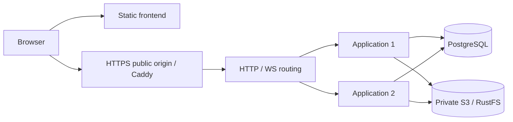

# How to Deploy Open Agricola

[English](HOW_TO_DEPLOY.md) | [中文](HOW_TO_DEPLOY_zh.md)

> 本文件是中文翻译镜像；[HOW_TO_DEPLOY.md](HOW_TO_DEPLOY.md) 是唯一权威版本。

本文档面向想要自行部署 Open Agricola 平台的开发者。

## 架构概览




前端和后端完全分离——前端是纯静态文件（GitHub Pages），后端是一个 Docker 容器（VPS）。

---

## 一、部署后端

后端部署分两种情况：
- **情况 A**：全新 VPS，只有公网 IP，没有域名
- **情况 B**：有域名 + 已有 HTTPS（Nginx + Let's Encrypt / Certbot）

两种情况都需要先完成基础步骤。

### 1. 基础步骤（两种情况通用）

准备 Node.js 24.15+（不支持 Node 25）、pnpm、Docker Compose、Git。生产 Compose 在同一台机器的 app 容器内启动两个独立应用进程，通过公开 HTTP/WS 路由进程接入，共享 PostgreSQL 18 和 RustFS。生产配置固定 `APP_INSTANCES=2`，即使 `.env` 中保留本地开发的 `1` 也会启动两个。无需申请外部服务。本地开发仍默认一个应用进程，使用 `./restart-local.sh --instances 2` 即可在本机验证相同的双进程路由。

旧 SQLite 单实例的性能报告仅是历史基线；继续保留应用的既有容量上限，不把这些数字当作 PostgreSQL、双实例或高可用认证。本次只验正常功能和重启，不做故障注入或恢复计时。

```bash
git clone https://github.com/YOUR_USER/open-agricola.git
cd open-agricola
pnpm install --frozen-lockfile
cp .env.example .env
```

设置 `.env` 中原有 `PUBLIC_API_BASE`、`PUBLIC_APP_ORIGIN`、`CORS_ORIGIN` 和账号/OAuth 参数；已有 callback 不改。把 `DATABASE_URL` 与 `S3_*` 连接组留空即使用本机服务。配置外部 S3 时需要完整 endpoint、region、bucket、access key 和 secret，桶必须私有。

```bash
node --env-file=.env scripts/local-services.mjs
GAME_BUILD_ID="$(git rev-parse HEAD)" docker compose -f docker-compose.prod.yml build app
```

依赖使用独立持久卷，生成凭据和 Workshop 加密密钥保存在 mode-600 的 `data/local-services.env`；主机工具使用 `data/dependencies.local`，容器使用 `data/dependencies.compose.env`。应用重建不清空数据库或资源。镜像包含 PostgreSQL 18 原生客户端和一个不可变 Viewer，启动时校验并上传到 S3。所有正式 Room 强制录制，资源不齐时拒绝开局。

#### 首次 SQLite 迁移

导入器只接受当前发布的 SQLite 结构（版本 33）。旧结构的逐级升级链已退役；切换存储前应先用当前 `main` 版本导出。源数据以只读方式打开，并保留到目标验证成功。

先停止旧应用，再复制它的数据目录。源目录挂载为只读，导入目标必须为空；禁止把旧卷覆盖为空数据库。下面的 `legacy-data` 必须包含原数据库、卡图、Replay 资源、Viewer 和 JSONL 删除 ledger。

```bash
docker compose -f docker-compose.prod.yml stop app
mkdir -p legacy-data backups
chmod 700 legacy-data backups
docker cp "$(docker compose -f docker-compose.prod.yml ps -aq app):/app/data/." legacy-data/
docker compose -f docker-compose.prod.yml run --rm --no-deps \
  -v "$PWD/legacy-data:/legacy:ro" -v "$PWD/backups:/backup" app \
  node --import tsx scripts/import-sqlite.ts /legacy /backup/sqlite-import.json --applications-stopped
```

导入校验原始行值、恢复文本、Replay 字节/hash、Room-owned 恢复及资源引用。只丢弃已证实未录制的活动局，不补造历史；账号、工坊、录制局、结果和被引用资源保留。失败会留下启动屏障，继续处理该导入，不删除无关数据。全新安装无需旧库复制和导入，只执行下面的目标库校验。

```bash
docker compose -f docker-compose.prod.yml run --rm --no-deps app \
  node --import tsx scripts/storage-archive-cli.ts check-live "$(git rev-parse HEAD)" --applications-stopped
mkdir -p data
touch data/postgres-cutover.validated
# Configure deploy/Caddyfile using the existing public backend domain first.
docker compose -f docker-compose.prod.yml up -d --no-build --wait app caddy
```

开发环境同样使用 `scripts/import-sqlite.ts`，加载 `data/dependencies.local` 后指向只读旧目录，再运行 `./restart-local.sh`。历史源数据应保留到目标版本验证完成。

公开 origin 保持不变。浏览器先查询 Room 目录，再通过同源 `/nodes/<instanceId>/ws` 连接 owner；私有实例端口不开放到公网。默认 Compose 本地入口只绑定 loopback。Caddy 生产入口继续支持现有 443/8443，OAuth callback、cookie 和跨域配置沿用现有值。

Bug Report GitHub App、Workshop PR 和账号 OAuth 都仍是可选集成；配置表和独立 OAuth 文档保留它们的权限与回调要求。迁移 PostgreSQL/S3 不要求重新授权第三方账号。

---

### 情况 A：全新 VPS，只有公网 IP，没有域名

> 适用于：刚买的 VPS，没有域名，想用最简单的方式让后端跑起来。

#### 方案 A1：纯 HTTP（仅限测试，前端也需 HTTP）

最简单的方式。缺点：**GitHub Pages 是 HTTPS，无法直接连接 HTTP 后端**（浏览器会拦截混合内容）。所以前端也必须用 HTTP 方式部署（不用 GitHub Pages，用 VPS 自身提供静态文件）。

**步骤：**

1. 编辑 `.env`：

   ```env
   CORS_ORIGIN=*
   ```

2. 修改 `docker-compose.yml`，在 app 容器中挂载前端构建产物：

   ```bash
   # 本地构建前端（指向 VPS 公网 IP）
   VITE_API_BASE=http://YOUR_VPS_IP:5175 pnpm run build
   ```

3. 把 `dist/` 目录上传到 VPS，然后用简单 HTTP 服务器托管：

   ```bash
   # 在 VPS 上
   cd dist
   python3 -m http.server 8080 &
   ```

4. 访问 `http://YOUR_VPS_IP:8080`

5. WebSocket 地址：`ws://YOUR_VPS_IP:5175/ws`

> ⚠️ 此方案不安全（明文传输密码），仅用于本地测试或内网。

#### 方案 A2：Caddy 自签 / IP 直连 + 自动 HTTPS（推荐，需要域名）

如果你有域名（即使是免费的），Caddy 可以自动申请 Let's Encrypt 证书，零配置 HTTPS。

**获取免费域名（可选）：**

- [DuckDNS](https://www.duckdns.org/) — 免费子域名，如 `your-game.duckdns.org`
- [No-IP](https://www.noip.com/) — 免费 DDNS
- [FreeDNS](https://freedns.afraid.org/) — 免费子域名

**步骤：**

1. 把域名 DNS A 记录指向你的 VPS IP

2. 创建 `deploy/Caddyfile`：

   ```
   your-game.duckdns.org {
       reverse_proxy app:5175
   }
   ```

3. 使用仓库中的 `docker-compose.prod.yml`，保留完整 PostgreSQL/S3、OAuth 和入口配置。

4. 启动：

   ```bash
   docker compose -f docker-compose.prod.yml up -d --build
   ```

5. 验证：

   ```bash
   curl https://your-game.duckdns.org/api/health
   ```

6. 前端 `VITE_API_BASE` 设为 `https://your-game.duckdns.org`

> Caddy 会自动申请和续期 Let's Encrypt 证书，你无需手动管理。

---

### 情况 B：已有域名 + HTTPS（Nginx + Let's Encrypt）

> 适用于：VPS 上已经跑了 Nginx，已通过 Certbot 配了 HTTPS 证书。

这种情况最简单——Docker 只暴露 HTTP 端口，Nginx 做反向代理 + TLS 终止。

**步骤：**

1. 编辑 `.env`：

   ```env
   CORS_ORIGIN=https://YOUR_USER.github.io
   ```

2. 确保 `docker-compose.yml` 端口映射绑定到 `127.0.0.1`（仅本地可访问）：

   ```yaml
   ports:
     - "127.0.0.1:5175:5175"
   ```

3. 启动 Docker：

   ```bash
   docker compose up -d --build
   ```

4. 为后端 API 添加一个 Nginx server block 或 location。

   因为下面配置会覆盖 `X-Forwarded-For`，同时在后端 `.env` 设置 `REPLAY_TRUST_PROXY=true`。

   **方式一：子域名（推荐）**，如 `api.your-domain.com`

   先申请子域名证书：

   ```bash
   sudo certbot --nginx -d api.your-domain.com
   ```

   然后添加 Nginx 配置 `/etc/nginx/sites-available/open-agricola-api`：

   ```nginx
   server {
       listen 443 ssl;
       server_name api.your-domain.com;

       ssl_certificate     /etc/letsencrypt/live/api.your-domain.com/fullchain.pem;
       ssl_certificate_key /etc/letsencrypt/live/api.your-domain.com/privkey.pem;

       location / {
           proxy_pass http://127.0.0.1:5175;
           proxy_http_version 1.1;

           # WebSocket 支持（必须，否则多人游戏不工作）
           proxy_set_header Upgrade $http_upgrade;
           proxy_set_header Connection "upgrade";

           proxy_set_header Host $host;
           proxy_set_header X-Real-IP $remote_addr;
           proxy_set_header X-Forwarded-For $remote_addr;
           proxy_set_header X-Forwarded-Proto $scheme;

           # WebSocket 超时设长一些
           proxy_read_timeout 86400s;
           proxy_send_timeout 86400s;
       }
   }

   server {
       listen 80;
       server_name api.your-domain.com;
       return 301 https://$host$request_uri;
   }
   ```

   **方式二：子路径**，如 `your-domain.com/agricola-api/`

   在现有 server block 里添加：

   ```nginx
   location /agricola-api/ {
       rewrite ^/agricola-api/(.*) /$1 break;
       proxy_pass http://127.0.0.1:5175;
       proxy_http_version 1.1;
       proxy_set_header Upgrade $http_upgrade;
       proxy_set_header Connection "upgrade";
       proxy_set_header Host $host;
       proxy_set_header X-Real-IP $remote_addr;
       proxy_set_header X-Forwarded-For $remote_addr;
       proxy_read_timeout 86400s;
       proxy_send_timeout 86400s;
   }
   ```

5. 启用配置并重载 Nginx：

   ```bash
   # 仅子域名方式需要
   sudo ln -s /etc/nginx/sites-available/open-agricola-api /etc/nginx/sites-enabled/

   sudo nginx -t          # 测试配置
   sudo systemctl reload nginx
   ```

6. 验证：

   ```bash
   curl https://api.your-domain.com/api/health
   ```

7. 前端 `VITE_API_BASE` 设为 `https://api.your-domain.com`（或 `https://your-domain.com/agricola-api`）

   后端使用子路径时，生产 `PUBLIC_API_BASE` 需设置为相同的公开 API base（包含 `/agricola-api`，末尾不加斜杠）。Nginx 转发前去掉该前缀；运行看板交接、Cookie 路径和私有 Grafana 代理保留此前缀供浏览器访问。Grafana root URL 使用同一 base 加 `/ops/`。

> **关键：Nginx 必须转发 WebSocket**。如果忘了 `Upgrade` / `Connection` 头，HTTP API 正常但多人游戏会断连。

---

## 二、部署前端（GitHub Pages）

### 前置条件

- GitHub 仓库 Settings → Pages → Source 选 **GitHub Actions**
- 仓库 Settings → Environments → `github-pages` → Deployment branches and tags：允许 `main` 和 tag 模式 `v*`（release 部署以 tag 为 ref 运行，缺 tag 规则会被拒绝部署）

### 配置

在 Settings → Secrets and variables → Actions → **Variables** 标签中添加：

| Variable | 值 | 示例 |
|----------|---|------|
| `VITE_API_BASE` | 后端完整 URL | `https://api.your-domain.com` 或 `http://VPS_IP:5175`（仅 HTTP 方案） |
| `VITE_WS_BASE` | WebSocket URL（可选，自动推导） | `wss://api.your-domain.com/ws` |
| `VITE_SANDBOX_EXECUTOR` | 工坊试玩沙盒执行器（可选） | `browser` = 试玩全程在浏览器本地运行（引擎 Worker + 本地编译，零服务器参与）；缺省 / 其他值 = 走服务端 `/api/game/new-sandbox` |

### 触发部署

发布 GitHub Release 后自动部署前端（`.github/workflows/deploy-pages.yml`，`on: release: published`）：

```bash
gh release create v0.3.0 --generate-notes
```

也可以在 GitHub UI 操作：Releases → Draft a new release → 新建 tag（`vX.Y.Z`）→ Generate release notes → Publish。后端不会由 release 自动部署。Actions 页面手动触发（workflow_dispatch）时部署 `main` 最新前端。

部署成功后访问：`https://YOUR_USER.github.io/open-agricola/`

### 手动构建（不用 GitHub Actions）

```bash
VITE_API_BASE=https://api.your-domain.com pnpm run build
pnpm dlx gh-pages -d dist
```

### 主站图片资源

`public-assets.ref` 固定图片仓的 Git commit，`public-assets.required.json` 声明主站需要的全部路径。构建和默认本地启动读取图片站的 `asset-version.txt` 和 `asset-manifest.json`；两者都必须与 `public-assets.ref` 一致，且清单必须包含所有必需路径。元数据不可达、响应无效、版本不一致或缺少文件都会使启动/构建失败。请求只访问公共 Pages 地址，不携带 GitHub API 凭据。测试配置只读取本地契约，不依赖网络。新构建统一从 `https://titanxxh.github.io/open-agricola-assets/assets/...` 加载公共图片和字体，并用 `?v=<public-assets.ref>` 更新缓存。主站、初始 HTML 背景预加载、生成的 CSS 和不可变 Replay Viewer 对所有访客使用同一 Pages 来源，Replay CSP 允许该图片站路径的图片和字体，也保留旧 raw 图片仓路径的许可，供已有房间锁定的不可变 Viewer 使用；新构建仅包含 Pages 资源 URL。不按地域分流，也不在运行时回退 raw。公共资源本身不再打进主站 Pages artifact。图片仓按既有设计只发布当前文件，查询参数是缓存键，不是历史文件快照。

本地修改图片时可全量切到一个资产仓 checkout：

```bash
PUBLIC_ASSET_LOCAL_DIR=../open-agricola-assets pnpm dev
```

启动前会检查全部必需文件；缺少任一文件即失败，不会混用或回退到远端。该覆盖仅用于本地开发服务器，CI 和生产构建不接受它。

更新公共资源时先把 `open-agricola-assets` 发布到图片仓 Pages，等待其 workflow 将所有线上文件与该 commit 逐一校验，再把主仓 `public-assets.ref` 更新为线上 `asset-version.txt`，同步 `public-assets.required.json`，随后走主仓正常 Release。只修改文档的图片仓 commit 也会改变部署版本标记。旧 Viewer Build 保留代码，公共卡图和字体跟随图片站当前文件。

---

## 三、更新部署

### 后端

从 owner 控制的本机运行 `./deploy-backend.sh <ssh-host> [ref] [remote-dir]`。脚本拒绝覆盖远端已跟踪文件的本地修改，以安全 checkout 切换目标版本。目标镜像构建时旧应用继续运行；之后停止整组应用，在维护锁内导出 PostgreSQL 和 S3，先在隔离数据库/对象 prefix 中使用目标镜像恢复与校验，再迁移并验证实际目标库，最后启动同一部署代际的全部应用。

预检失败可重启未修改数据的旧容器。实际迁移开始后若校验失败，保持维护状态，不自动把旧程序连到可能已变更的 schema。`data_imports` 持久屏障阻止失败目标启动。脚本等待容器健康检查；这不是生产部署授权，也不是故障恢复认证。

### 前端

发布 GitHub Release 后自动重新部署（见上文「触发部署」）。

---

## Auth OAuth

生产环境可启用密码注册（需要 Resend 邮箱验证）和 GitHub / Google OAuth；`ACCOUNT_REGISTRATION_POLICY` 统一控制注册入口。

OAuth 所需后端环境变量：

- `PUBLIC_APP_ORIGIN`：用户在浏览器中打开的前端地址；GitHub Pages 子路径部署要包含 base path，例如 `https://your-user.github.io/open-agricola/`。
- `PUBLIC_API_BASE`：用户浏览器可访问的后端 origin，例如 `https://api.your-domain.com`，用于 OAuth provider callback URL 和邮箱验证链接；生产环境必填。
- `CORS_ORIGIN`：前后端不同源时必须等于前端 origin。
- `ACCOUNT_GITHUB_OAUTH_CLIENT_ID` / `ACCOUNT_GITHUB_OAUTH_CLIENT_SECRET`：账号登录/注册用 GitHub OAuth App 凭据。
- `ACCOUNT_GOOGLE_OAUTH_CLIENT_ID` / `ACCOUNT_GOOGLE_OAUTH_CLIENT_SECRET`：账号登录/注册用 Google OAuth Client 凭据。

OAuth callback URL 填后端 origin：

```text
https://<backend-origin>/api/auth/oauth/github/callback
https://<backend-origin>/api/auth/oauth/google/callback
```

生产环境不要设置：

- `ALLOW_ANONYMOUS_WS=true`
- `ENABLE_AUTH_TEST_HELPERS=1`

---

## 四、验证清单

部署完成后逐项验证：

- [ ] `curl https://your-backend/api/health` 返回 `{"ok":true}`
- [ ] 访问前端 URL，能看到登录页
- [ ] 首次部署时先用 `ACCOUNT_REGISTRATION_POLICY=open` 注册 `ADMIN_USERS` 中的第一个管理员账号
- [ ] 管理员能进入 Settings 生成邀请码后，将 `ACCOUNT_REGISTRATION_POLICY` 改为 `invite_only` 并重启后端
- [ ] 通过 GitHub 或 Google + 邀请码注册新用户
- [ ] 登录成功，进入大厅
- [ ] 创建房间，开始游戏
- [ ] WebSocket 连接正常（浏览器 Console 无 WS 错误）
- [ ] 双人模式：两个浏览器窗口加入同一房间
- [ ] 进行局与结束局原参与者都能打开三步 Bug Report，非参与者被拒绝
- [ ] 本人 GitHub 与 Hosted Identity 各创建一个 Issue，正文只含现象、Reporter ID 和对局锚点
- [ ] Settings 能断开 Issue Submission Connection，GitHub 撤销授权后连接状态失效
- [ ] Workshop：创建/浏览自定义卡牌
- [ ] Card art 上传和显示正常
- [ ] `docker compose down && docker compose up -d` 后数据仍在（SQLite 持久化）

---

## 五、环境变量参考

### 后端（Docker / .env）

| 变量 | 默认值 | 说明 |
|------|--------|------|
| `DATABASE_URL` | 本机自动生成 | PostgreSQL URL；外部切换前先搬迁、校验数据 |
| `S3_ENDPOINT`, `S3_REGION`, `S3_BUCKET` | 本机自动生成 | 私有 S3 地址和桶 |
| `S3_ACCESS_KEY_ID`, `S3_SECRET_ACCESS_KEY` | 本机自动生成 | S3 凭据，不写入 Git |
| `S3_PREFIX` | 空 | 当前环境对象 namespace |
| `APP_INSTANCES` | 本地：`1`；生产：`2` | 本地启动可选 `1` 或 `2`；生产 Compose 固定同机两个应用进程 |
| `BACKEND_PORT` | `5175` | HTTP/WS 监听端口 |
| `BACKEND_HOST` | `0.0.0.0` | 绑定地址 |
| `NODE_ENV` | — | 设为 `production` 启用生产模式 |
| `ALLOW_ANONYMOUS_WS` | `true`(dev) / `false`(prod) | 是否允许未登录调用者使用匿名 WebSocket 房间和 HTTP 调试沙箱（`/api/game/*`） |
| `CORS_ORIGIN` | `*` | 允许的前端域名，生产环境必须设置 |
| `PUBLIC_APP_ORIGIN` | — | 前端公开地址；Pages 子路径部署要包含 `/open-agricola/` |
| `PUBLIC_API_BASE` | — | 后端公开 origin，用于 OAuth provider callback URL 和邮箱验证链接；生产环境必填 |
| `EMAIL_DELIVERY` | `log` | 邮件发送模式；生产用户名密码注册必须设为 `resend` |
| `RESEND_API_KEY` | — | Resend API key，只给后端容器 |
| `EMAIL_FROM` | — | 发信地址，例如 `Open Agricola <no-reply@mail.example.com>` |
| `EMAIL_REPLY_TO` | — | 可选回复地址 |
| `ACCOUNT_GITHUB_OAUTH_CLIENT_ID` | — | 账号 GitHub OAuth App client id |
| `ACCOUNT_GITHUB_OAUTH_CLIENT_SECRET` | — | 账号 GitHub OAuth App client secret |
| `ACCOUNT_GOOGLE_OAUTH_CLIENT_ID` | — | 账号 Google OAuth client id |
| `ACCOUNT_GOOGLE_OAUTH_CLIENT_SECRET` | — | 账号 Google OAuth client secret |
| `BUG_REPORTS_ENABLED` | `false` | 是否允许创建新的 Bug Report 草稿 |
| `BUG_REPORT_GITHUB_APP_ID` | — | 独立 Bug Report GitHub App ID；唯一可写权限为 `Issues: write` |
| `BUG_REPORT_GITHUB_CLIENT_ID` | — | GitHub App Client ID |
| `BUG_REPORT_GITHUB_CLIENT_SECRET` | — | GitHub App Client secret |
| `BUG_REPORT_GITHUB_PRIVATE_KEY` | — | GitHub App private key，使用单行 `\n` 转义 |
| `BUG_REPORT_GITHUB_WEBHOOK_SECRET` | — | GitHub App webhook secret |
| `BUG_REPORT_GITHUB_INSTALLATION_ID` | — | 可访问 `titanxxh/open-agricola` 的 App installation ID |
| `BUG_REPORT_GITHUB_REPOSITORY_ID` | — | `titanxxh/open-agricola` 数字 repository ID：`1164782262` |
| `BUG_REPORT_TOKEN_ENCRYPTION_KEYS` | — | AES-256-GCM key ring JSON；每个值为 32 字节 base64 |
| `BUG_REPORT_TOKEN_ACTIVE_KEY_ID` | — | 新令牌使用的 key ring key ID |
| `ENABLE_AUTH_TEST_HELPERS` | — | 仅本地/E2E 可设 `1`，生产禁止设置 |
| `REPLAY_VIEWER_BUILD_ID` | — | 新 Room 锁定的不可变 Viewer Build ID |
| `REPLAY_TRUST_PROXY` | `false` | 仅当后端只能经会覆盖 `X-Forwarded-For` 的可信反向代理访问时设为 `true` |
| `GAME_BUILD_ID` | — | 当前后端 Git commit；自动部署脚本会填入 |
| `ADMIN_USERS` | — | 管理员用户名，逗号分隔 |
| `ACCOUNT_REGISTRATION_POLICY` | 必填 | 账号注册策略：首次部署用 `open` 创建第一个管理员，之后改为 `invite_only`；`disabled` 禁止新账号注册 |
| `GITHUB_UPSTREAM_OWNER` / `GITHUB_UPSTREAM_REPO` | `titanxxh` / `open-agricola` | Workshop PR 目标仓库 |
| `WORKSHOP_PR_ENABLED` | `false` | 是否开放 Workshop → PR |
| `WORKSHOP_REVIEW_GITHUB_APP_ID` | — | Workshop submission and review GitHub App ID |
| `WORKSHOP_REVIEW_GITHUB_PRIVATE_KEY` | — | App private key，使用单行 `\n` 转义 |
| `WORKSHOP_REVIEW_GITHUB_INSTALLATION_ID` | — | App 在主仓库的 installation ID |
| `WORKSHOP_REVIEW_GITHUB_WEBHOOK_SECRET` | — | `/api/github/webhook` HMAC secret |
| `OFFSITE_BACKUP_TARGET` | — | 定时异机备份的 ssh 目标（如 `root@1.2.3.4`）；仅 `backup-offsite.sh` 读取，不进应用容器 |
| `OFFSITE_BACKUP_REMOTE_DIR` | `/root/open-agricola-backups` | 异机上的备份存放目录；仅 `backup-offsite.sh` 读取 |

### Bug Report 仓库

Game Bug Reports 交付到公开的 `titanxxh/open-agricola` 仓库。将独立 Bug Report GitHub App 安装到该仓库，仅授予 `Issues: write` 可写权限，并在部署后端前配置对应 installation ID 和 repository ID（`1164782262`）。沿用现有 callback、webhook 和令牌加密配置。当提交身份无法设置标签时，`bug-report-triage.yml` workflow 为游戏内报告补上 `needs-triage`。

修改目标不会转移已有 GitHub Issue，也不会重写已保存的报告引用。切换已有部署前，先对账未完成的提交，再转移需要保留的报告，并将已保存的 Issue 编号和 URL 更新为目标仓库中的引用；完成后再废弃原仓库。

### Resend 邮箱验证

1. 在 Resend 添加并验证发信域名。
2. 创建 Sending access API key。
3. 在后端 `.env` 中设置：

   ```bash
   EMAIL_DELIVERY=resend
   RESEND_API_KEY=re_xxx
   EMAIL_FROM="Open Agricola <no-reply@mail.example.com>"
   ```

4. 确认 `PUBLIC_API_BASE` 是用户可访问的后端 HTTPS 地址，`PUBLIC_APP_ORIGIN` 是前端地址。

### 前端（构建时注入）

| 变量 | 默认值 | 说明 |
|------|--------|------|
| `VITE_API_BASE` | `''`（空=同源） | 后端 API 地址 |
| `VITE_WS_BASE` | 从 API_BASE 推导 | WebSocket 地址 |
| `PUBLIC_ASSET_LOCAL_DIR` | — | 仅本地开发：完整图片仓 checkout；设置后禁止远端混用或回退 |

---

## 六、常见问题

### WebSocket 连接失败

- 确认后端 HTTPS 配置正确（GitHub Pages 是 HTTPS，WS 必须用 `wss://`）
- 确认反向代理转发 WebSocket upgrade 头（Nginx 需要 `proxy_set_header Upgrade`）
- 检查 `VITE_WS_BASE` 是否正确设置
- Nginx `proxy_read_timeout` 太短会导致 WS 连接被切断，建议 `86400s`

### CORS 错误

- 检查 `.env` 中 `CORS_ORIGIN` 是否与前端域名完全匹配（含 `https://`，不含尾部 `/`）
- 如果使用自定义域名，确保 `CORS_ORIGIN` 与实际访问域名一致

### 混合内容被拦截（Mixed Content）

- 浏览器会阻止 HTTPS 页面加载 HTTP 资源
- 解决：后端必须配置 HTTPS（方案 A2 或情况 B）
- 临时方案：前端也用 HTTP 部署（方案 A1），但不安全

### 卡牌图片不显示

- 不影响游戏功能，仅影响显示
- 确认 `public-assets.ref` 指向已发布的素材仓 commit，且 `public-assets.required.json` 列出了所有需要的路径

### 数据备份

普通归档包含 PostgreSQL 原生 custom-format dump、S3 不可变对象及 SHA-256/长度清单。最新删除 ledger 独立保存，绝不从旧归档恢复覆盖。`env-<stem>` 是 mode-600 的配置 tar，包含 `.env`、容器连接配置和本机凭据/加密密钥；不要当作明文 `.env` 直接复制。

```bash
bash scripts/backup-storage.sh "manual-$(date -u +%Y%m%dT%H%M%SZ)"
./backup-offsite.sh                 # Optional configured offsite copy
./backup-offsite.sh ledger-only     # Refresh deletion facts without stopping applications
```

备份脚本停止应用并导出数据，恢复服务后在隔离 PostgreSQL 数据库和 S3 prefix 中做目标版本校验。manifest 记录源/目标构建和归档 hash/长度。默认验证账号需要 `CREATEDB`；外部托管服务可提供单独的空 `VALIDATION_DATABASE_URL`，该目标仅用于此次验证。旧 SQLite 的写入/容量数字不能用于这些备份或恢复能力的声明。

每日备份与部署共用 `backups/.maintenance.lock`。保留策略仍是本地 daily 7 份、pre 5 份，异机 daily 30 份、pre 10 份，所有普通归档及其配置快照最多 30 天。保留 `deploy/offsite-retention.sh` 的异机独立 cron，删除 ledger 不受归档清理影响。配置 `OFFSITE_BACKUP_TARGET` 和 `OFFSITE_BACKUP_REMOTE_DIR` 后安装仓库 `deploy/open-agricola-backup.cron` 与 logrotate 配置；无异机时仍可执行本机手动备份。

异机 ledger 同步先读远端副本，合并到当前 S3 的 CAS ledger，再导出其并集。旧普通备份、旧本地副本都不能抹掉较新的删除事实。立即删除后的异机同步仍使用 `ledger-only`。

#### 恢复或切换外部服务

停止全部应用。准备目标版本镜像、原始归档、配对 manifest、最新独立 ledger、保留的加密密钥，以及一个空目标数据库和隔离的目标对象 namespace。先核对 tar 的 SHA-256/长度与 manifest，然后解包到私有目录；恢复工具还会核对内层数据库和每个对象的 hash/长度。配置目标连接组后运行：

```bash
# /restore/archive contains archive.json, database.dump, and objects/.
# The current ledger was obtained independently, not extracted from the archive.
docker compose -f docker-compose.prod.yml run --rm --no-deps \
  -v "$PWD/restore:/restore"   -e CURRENT_ERASURE_LEDGER=/restore/replay-removals.latest.json app \
  node --import tsx scripts/storage-archive-cli.ts restore /restore/archive --applications-stopped
docker compose -f docker-compose.prod.yml run --rm --no-deps app \
  node --import tsx scripts/storage-archive-cli.ts check-live "$(git rev-parse HEAD)" --applications-stopped
docker compose -f docker-compose.prod.yml up -d --no-build --wait app caddy
```

恢复先合并当前删除事实，再放置允许保留的对象、恢复 PostgreSQL、应用目标 migration，并验证 Room-owned 恢复、Replay 全链及资源。失败不能启用目标库；保留原数据端点并处理报错。切换配置不是迁移数据，不能省略导出/恢复/校验。当前单机功能不承诺故障时间或物理主机高可用。

### Replay 下架

CLI 只接受精确 Room ID 和 `removed`、`moderation`、`legal` 三种原因。先停后端并 dry-run，确认输出的 Room 与资源 Hash 后再执行：

```bash
OA_ROOM_ID=replace-with-exact-room-id
docker compose -f docker-compose.prod.yml stop app
docker compose -f docker-compose.prod.yml run --rm --no-deps app \
  node --import tsx scripts/replay-removal.ts remove \
  --room-id "$OA_ROOM_ID" --reason moderation --dry-run
docker compose -f docker-compose.prod.yml run --rm --no-deps app \
  node --import tsx scripts/replay-removal.ts remove \
  --room-id "$OA_ROOM_ID" --reason moderation
mkdir -p backups
docker compose -f docker-compose.prod.yml run --rm --no-deps \
  -v "$PWD/backups:/backup" app node --import tsx scripts/storage-archive-cli.ts \
  ledger-export /backup/replay-removals.latest.json
docker compose -f docker-compose.prod.yml up -d app
```

法律请求明确要求删除 Game Result Archive 时，仅可使用 `legal` 原因并追加 `--erase-result`；该模式不能和 `--asset-hash` 组合：

```bash
OA_ROOM_ID=replace-with-exact-room-id
docker compose -f docker-compose.prod.yml stop app
docker compose -f docker-compose.prod.yml run --rm --no-deps app \
  node --import tsx scripts/replay-removal.ts remove \
  --room-id "$OA_ROOM_ID" --reason legal --erase-result --dry-run
docker compose -f docker-compose.prod.yml run --rm --no-deps app \
  node --import tsx scripts/replay-removal.ts remove \
  --room-id "$OA_ROOM_ID" --reason legal --erase-result
mkdir -p backups
docker compose -f docker-compose.prod.yml run --rm --no-deps \
  -v "$PWD/backups:/backup" app node --import tsx scripts/storage-archive-cli.ts \
  ledger-export /backup/replay-removals.latest.json
docker compose -f docker-compose.prod.yml up -d app
```

若违规对象是自定义卡图片本身，再传精确的 64 位内容 Hash；dry-run 会列出所有引用该资源、将一并 Tombstone 的 Room：

```bash
OA_ASSET_HASH=replace-with-64-character-sha256
docker compose -f docker-compose.prod.yml stop app
docker compose -f docker-compose.prod.yml run --rm --no-deps app \
  node --import tsx scripts/replay-removal.ts remove \
  --room-id "$OA_ROOM_ID" --reason legal \
  --asset-hash "$OA_ASSET_HASH" --dry-run
docker compose -f docker-compose.prod.yml run --rm --no-deps app \
  node --import tsx scripts/replay-removal.ts remove \
  --room-id "$OA_ROOM_ID" --reason legal \
  --asset-hash "$OA_ASSET_HASH"
mkdir -p backups
docker compose -f docker-compose.prod.yml run --rm --no-deps \
  -v "$PWD/backups:/backup" app node --import tsx scripts/storage-archive-cli.ts \
  ledger-export /backup/replay-removals.latest.json
docker compose -f docker-compose.prod.yml up -d app
```

资产下架可使用 ledger 已证明引用关系的既有 Tombstone Room 作为入口。违规 Hash 会作为永久规则写入 ledger：旧备份恢复时自动下架新增引用，后续 Room 也不能重新归档同一内容。操作幂等；普通整局下架只删除不再被其他 Replay 引用的资源。成功后立即执行 `./backup-offsite.sh ledger-only` 异机备份最新 `replay-removals.jsonl`。

### Bug Report token 密钥轮换

1. 生成新的 32 字节随机 key，加入 `BUG_REPORT_TOKEN_ENCRYPTION_KEYS`，保留旧 key。
2. 把 `BUG_REPORT_TOKEN_ACTIVE_KEY_ID` 改为新 key id，重启后端；新连接和后续 token refresh 会使用新 key。
3. 旧 key 仍用于解密尚未刷新连接，不能提前删除。检查 `issue_submission_connections.key_id`，并等待旧 key 行数归零；仍有效的旧 `oauth_states.pkce_verifier_key_id` 也必须归零或过期。
4. 确认 Hosted 与本人 GitHub 提交都成功后，才从 key ring 删除旧 key 并再次重启。轮换期间不要修改已有 key id 对应的 key 内容。

### 本地开发与自包含依赖

```bash
pnpm install
./restart-local.sh
```

`VITE_API_BASE` 未设置时默认为空字符串（同源），开发模式下前端自动连接 `localhost:5175`。

## 运行监控

预置 Grafana 看板使用中文标题、指标说明、图例及回合筛选显示标签。Grafana 默认界面语言为简体中文（`zh-Hans`）；指标名称、标签值及 PromQL 保持不变。

本地监控在启动前用 host-network 容器访问宿主机临时 loopback HTTP 服务。有限时检测失败时打印提示，继续启动普通应用；缺失监控数据保持未知。[Docker Desktop host networking](https://docs.docker.com/engine/network/drivers/host/#docker-desktop) 需 4.34+，并在 Settings → Resources → Network 中启用 Enable host networking。启用功能、准备好监控镜像后重新运行启动脚本。Docker Desktop 的 Node Exporter 主机指标对应其 Linux VM，不代表 macOS 物理主机。

`./restart-local.sh` 在常规应用之外准备并启动 Prometheus、Grafana、Node Exporter；`--instances 2` 验证两个应用 slot。Grafana 使用选定的本地后端绑定地址（包括 `--intranet`），不受 `.env` 中生产 `PUBLIC_API_BASE` 影响；Prometheus 采集该绑定地址，监控服务端口仍仅监听 loopback。关联 worktree 显式传递共享数据目录，继续使用主 checkout 的观测数据。本地监听仅绑定 **127.0.0.1**：Prometheus 19090、Grafana 13000、Node Exporter 19100。`OBSERVABILITY_ENABLED=false ./restart-local.sh` 跳过监控启动，不删除已有数据。运行密钥、配置及 TSDB/Grafana 数据位于主 checkout 的忽略目录 `data/observability/`。metrics bearer secret 在 `data/local-services.env` 生成，以 0600 权限复制，不交给浏览器。

生产 `scripts/local-services.mjs` 自动准备配置，`deploy-backend.sh` 与 app/Caddy 一起启动三个监控服务；Grafana、Prometheus、Node Exporter 都不发布生产主机端口。私有 dependency network 是可信服务器边界，不能另加 Caddy 直连监控服务；公网仅通过应用网关访问 `/ops/`。不挂 Docker socket；Node Exporter 只读挂载 host root，并使用 host PID 可见性。部署账号不是 1000 时设置 `OBSERVABILITY_UID/GID`，确保该账号可读写 `data/observability/{prometheus,grafana}` 并读取 token 文件；应用继续使用 `APP_UID/GID`。

Prometheus 每 15 秒 scrape（超时 5 秒），每 15 秒发现有效应用租约，TSDB 保留 7 天。全站 DB 查询、认证用户 presence、cgroup/备份检查最多每 60 秒执行一次，复用进行中的采集。稳定 slot target 避免进程 UUID 产生长期 series。用 `rate`/`increase` 处理重启 counter reset，**先** `sum by(le,...)` 合并桶，再 `histogram_quantile`。看板提供 24h/7d 范围和 15 秒刷新。7 天属于 TSDB block 保留，不是逐样本精确删除时钟；部署前历史不补造，停机缺口保留为空，分布不能还原精确最大值。

| 指标族 / 边界 | 口径与汇总 |
|---|---|
| `agricola_http_*`，应用及入口 HTTP | 有界 route/method/status，结束或中止；入口与应用 role 分开 |
| command total、command/response histogram | 尝试及 ok/committed/unchanged/规则拒绝/重复/stale/blocked/取消/系统失败；解析 dispatch 到最终本地工作，与首次相关响应区分 |
| operation histogram：queue/preflight/commit/snapshot/encode/persist/publication/projection/json/send | 同一单调时钟；嵌套阶段不可相加；send 是入队，不是送达 |
| rule histogram | 命令与 native/Worker 模式；含 Worker 等待，不等于 Worker CPU |
| WS outgoing size histogram | 每个实际收件人的完整 UTF-8 JSON，有界 round/message type；count/sum 推导样本数/mean/频率/字节量；分位数面板要求 5 分钟内至少 20 样本 |
| publication payload / recipients | 一次提交发布的逐收件人字节总量及 fanout，不二次序列化 |
| WS errors / incoming bytes / buffered bytes | parse/send/socket 错误和应用背压；host 指标覆盖传输开销 |
| persistence payload / commit attempts | 确认提交的快照引用/主体 JSON、新插入 history/recovery JSON、Replay gzip；冲突/失败/重试算尝试，不算确认写入 |
| DB histogram / pool / errors | query 含 pool 等待；事务获取连接等待；BEGIN 到 COMMIT/ROLLBACK；有界 timeout/deadlock/connection-limit/unavailable/query 错误，不含 SQL |
| 全站 platform gauge | 认证 WS 用户去重、有效租约/epoch 房间数、开发/hotseat 分类、容量、连接及 24h/7d 完成局 |
| 运行 gauge / Node 默认指标 | 队列深度/年龄、blocked/retrying/permanent 房间、Worker active/reserved/busy/pending/capacity/timeouts、CPU/RSS/heap/ELU/lag/GC |
| cgroup / Node Exporter | app 容器限额、用量、throttle、IO；主机 CPU/内存/文件系统/磁盘/网络。两个应用 slot 共享 cgroup，不重复求和 |
| PostgreSQL / object / task gauge | 连接、锁、>30s 长事务、deadlock、数据库大小、cluster WAL；对象库存/staging；报告/删除/revocation backlog 和报告最早年龄 |
| S3 histogram / bytes | 公开存储操作墙钟，含 SDK 重试与完整读取；成功 payload 字节。SDK attempt 与 missing object 不单独成 series |
| 浏览器 duration / events | 10% 会话抽样：命令 RTT、连接到首快照、快照到 React layout commit；上传有界，无账号/房间/payload 身份 |
| collector success/status/errors / scrape | 最近真实成功采集、错误、scrape 耗时/样本数、exporter 可用性及观测开销 |
| 备份新鲜度 | 可选已验证 manifest 时间；缺失/无效为未知，不宣称正在备份的进度或恢复测试 |

`backup-storage.sh` 成功验证后原子更新 `backups/observability.latest.json`。生产只读挂载 backups，并设置 `OBSERVABILITY_BACKUP_MANIFEST`。本地可显式设置该变量指向有效 manifest。备份存在不等于恢复验证成功。

健康默认值是运行起点，不是容量认证：全站采集缺失/失败、年龄 ≥120 秒或应用来源覆盖不全为**未知**；没有 up 应用为**不可用**；就绪 slot 少于 `APP_INSTANCES`、任意 blocked Room、近期 DB 基础设施/S3 失败、命令 p95 >1 秒（5 分钟至少 20 样本）、5 分钟系统错误率 >2% 或就绪实例版本不一致、报告最早等待 >15 分钟、验证备份 >48 小时为**异常**。其余应用/DB 总览正常。S3 在 120 秒内无成功调用、备份缺失分别为未知，即使核心就绪正常。来源刷新/滚动窗口移出后恢复；没有外部通知或运维写入。刷新失败清空展示数值，保留最近采集时间。阈值不套用旧 SQLite 性能数据。

18 种回合、5 种消息、13 个 size bucket/count/sum series、两个应用 target，outgoing histogram 最多 2340 series，publication 族最多增加 792。常规运行预期应用 series 少于 15,000；15 秒/7 天约 6.05 亿样本。初期预留至少 5GB TSDB，观察实际磁盘、series 和 scrape 成本，不承诺压缩率。采集使用独立单连接 pool，获取连接最多 1 秒、语句最多 2 秒，在游戏命令路径之外执行，不遍历快照；初始开销预算为每个返回包额外 CPU 小于 0.5ms、本地正常负载全站采集小于 100ms。这不是生产延迟或容量验收。

回滚显示可用对应 Compose 停止 `prometheus grafana node-exporter`，保留数据供恢复；不要删除卷。趋势存储不可用时应用显示未知，游戏仍由原权威持久化与路由链路处理。本次不发布生产、不注入故障、不认证容量。

配置遵循官方 [Grafana auth proxy 文档](https://grafana.com/docs/grafana/latest/setup-grafana/configure-access/configure-authentication/auth-proxy/)和 [Prometheus 发现/配置文档](https://prometheus.io/docs/prometheus/latest/configuration/configuration/)。
